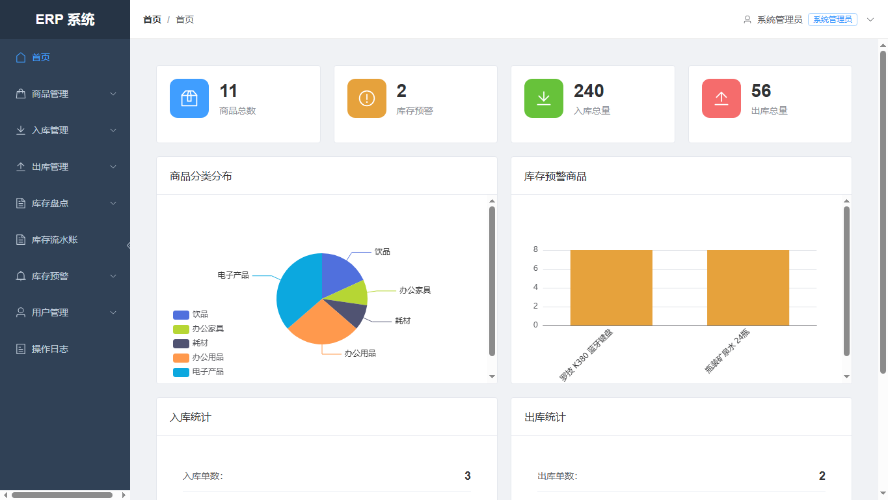
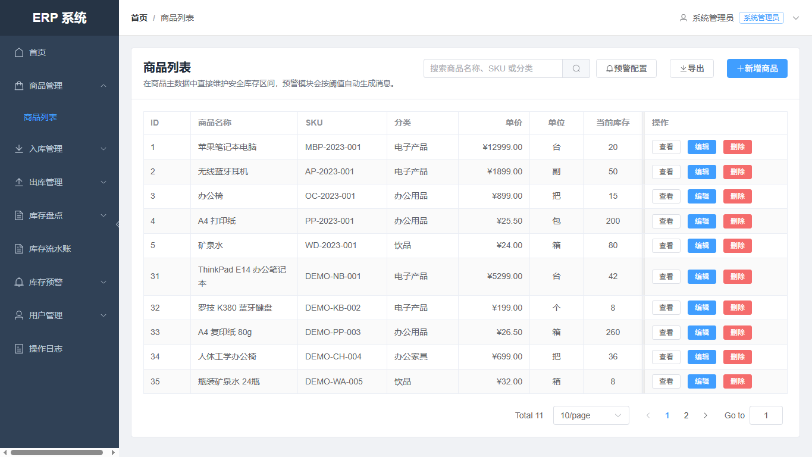
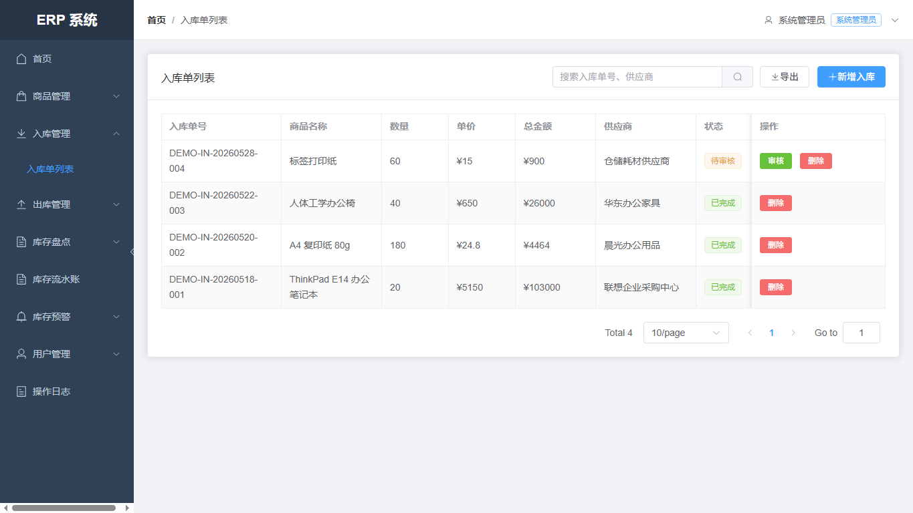
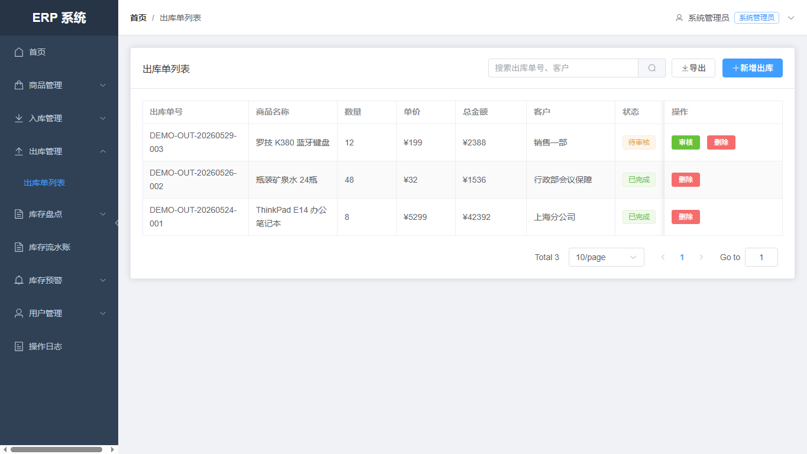
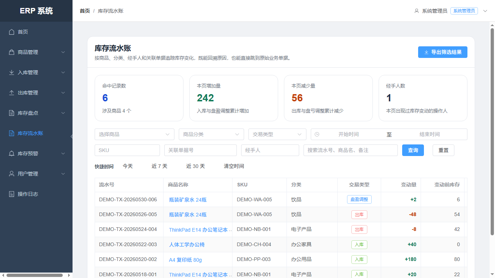
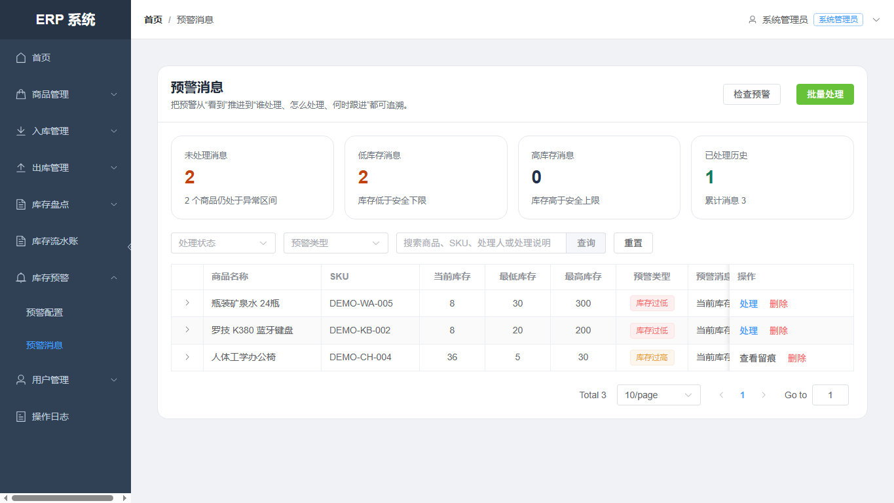

# ERP Inventory System


**Contact:** 2812447865@qq.com

`erp-inventory-system` 是一个基于 `Spring Boot + Vue 3` 的中小型企业库存管理系统。项目围绕商品主数据、入库、出库、库存盘点、库存流水、库存预警、用户权限和操作日志，构建了一套可追踪、可审核、可演示的库存业务闭环。

它解决的核心问题是：传统仓库依赖 Excel 或人工台账时，库存变化难追踪、审核责任不清晰、库存预警滞后、不同岗位权限边界模糊。本系统通过前后端分离、RBAC 权限控制、单据审核、库存流水和预警处理记录，让库存管理从“能记录”提升到“可追踪、可审核、可分析”。

## 目录

- [系统截图](#系统截图)
- [核心功能](#核心功能)
- [技术栈](#技术栈)
- [Docker Compose 一键启动](#docker-compose-一键启动)
- [本地开发启动](#本地开发启动)
- [演示账号](#演示账号)
- [演示数据](#演示数据)
- [项目结构](#项目结构)
- [测试与验证](#测试与验证)

## 系统截图

| 首页仪表盘 | 商品管理 |
| --- | --- |
|  |  |

| 入库管理 | 出库管理 |
| --- | --- |
|  |  |

| 库存流水 | 库存预警 |
| --- | --- |
|  |  |

## 核心功能

| 模块 | 说明 |
| --- | --- |
| 首页仪表盘 | 汇总商品数量、库存预警、入库总量、出库总量，并通过图表展示分类和预警情况。 |
| 商品管理 | 维护商品名称、SKU、分类、单位、价格、当前库存、安全库存上下限，支持分页、查询、新增、编辑和导出。 |
| 入库管理 | 创建入库单，审核通过后自动增加库存，并记录审核人、审核时间和库存流水。 |
| 出库管理 | 创建出库单，审核时校验库存是否充足，审核通过后扣减库存并生成出库流水。 |
| 库存盘点 | 支持盘点单、盘点明细、库存快照和差异调整，降低人工盘点导致的数据偏差。 |
| 库存流水 | 记录每次库存变更的商品、类型、数量、变更前库存、变更后库存、关联单据和操作人。 |
| 库存预警 | 根据商品安全库存上下限生成低库存/高库存预警，并记录处理方式、责任人和处理说明。 |
| 用户与权限 | 基于 JWT + Spring Security 实现登录认证，结合角色权限控制菜单、按钮和后端接口访问。 |
| 操作日志 | 使用 AOP 记录关键业务操作，方便审计和问题追踪。 |

## 技术栈

| 层级 | 技术 |
| --- | --- |
| 后端 | Java 17、Spring Boot 3.0.4、Spring Security、MyBatis-Plus、JJWT、EasyExcel、Knife4j |
| 前端 | Vue 3、Vite、TypeScript、Element Plus、Pinia、Vue Router、Axios、ECharts |
| 数据库 | MySQL 8.0+ |
| 工程化 | Docker Compose、Maven、npm、Nginx |
| 测试 | JUnit 5、MockMvc |

## Docker Compose 一键启动

推荐项目预览或本地部署时使用 Docker Compose，一条命令启动 `MySQL + Spring Boot 后端 + Vue/Nginx 前端`。

```bash
docker compose up --build
```

启动完成后访问：

```text
前端：http://localhost:3000
后端：http://localhost:8080
MySQL：localhost:3307
```

默认账号：

```text
admin / admin123
```

Compose 会自动完成：

- 创建 `erp_inventory` 数据库。
- 执行 `schema.sql` 建表。
- 执行 `data.sql` 初始化基础用户、角色、权限和商品数据。
- 执行 `demo-data.sql` 导入示例业务数据。
- 后端使用 `prod` 配置连接 Compose 内部 MySQL。
- 前端 Nginx 将 `/api` 反向代理到后端服务。

首次构建需要拉取基础镜像并下载 Maven/npm 依赖，耗时会明显长一些。项目已在 Dockerfile 中配置 Maven 阿里云镜像和 npm 镜像源，用于降低国内网络环境下的失败概率。第二次启动通常会复用缓存，速度会快很多。

如果需要清空数据库并重新初始化演示数据：

```bash
docker compose down -v
docker compose up --build
```

如果本机 `3000`、`8080` 或 `3307` 端口已被占用，可以修改 [docker-compose.yml](docker-compose.yml) 中的 `ports` 映射。

## 本地开发启动

### 环境要求

- JDK 17
- Maven 3.6+
- Node.js 20.19+ 或 22.12+
- MySQL 8.0+

### 创建数据库

```sql
CREATE DATABASE IF NOT EXISTS erp_inventory
DEFAULT CHARACTER SET utf8mb4
COLLATE utf8mb4_unicode_ci;
```

开发环境默认读取：

```properties
spring.datasource.url=jdbc:mysql://localhost:3306/erp_inventory
spring.datasource.username=root
spring.datasource.password=root
```

如需修改数据库连接，可通过 `DEV_DB_URL`、`DEV_DB_USERNAME`、`DEV_DB_PASSWORD` 环境变量覆盖。

### 启动后端

```bash
mvn clean test
mvn -DskipTests package
java -jar target/erp-inventory-system-0.0.1-SNAPSHOT.jar
```

后端默认地址：

```text
http://localhost:8080
```

### 启动前端

```bash
cd erp-inventory-web
npm install
npm run dev
```

前端默认地址：

```text
http://localhost:3000
```

## 演示账号

| 角色 | 用户名 | 密码 | 说明 |
| --- | --- | --- | --- |
| 系统管理员 | `admin` | `admin123` | 拥有系统全部权限 |
| 入库员 | `purchase` | `purchase123` | 负责入库相关操作 |
| 出库员 | `sales` | `sales123` | 负责出库相关操作 |
| 仓库管理员 | `warehouse` | `warehouse123` | 负责库存日常管理 |
| 仓库主管 | `manager` | `manager123` | 负责审核和管理 |
| 财务只读 | `finance` | `finance123` | 查看统计和业务数据 |

## 演示数据

项目提供可重复导入的演示数据脚本：[demo-data.sql](src/main/resources/demo-data.sql)。

演示数据覆盖：

- 6 个带 `DEMO-` SKU 的商品。
- 4 张入库单，覆盖已审核和待审核状态。
- 3 张出库单，覆盖已审核和待审核状态。
- 1 张库存盘点单和盘点明细。
- 6 条库存流水，覆盖入库、出库和盘盈调整。
- 3 条库存预警，覆盖未处理低库存和已处理高库存。
- 7 条操作日志，用于展示审计追踪。

如果使用本地 MySQL 手动导入：

```bash
mysql -uroot -proot --default-character-set=utf8mb4 erp_inventory < src/main/resources/demo-data.sql
```

脚本使用 `DEMO-` 前缀，支持重复执行，会先清理旧的演示数据再重新插入。

## 项目结构

```text
erp-inventory-system/
|-- docker-compose.yml                       # MySQL + 后端 + 前端一键启动
|-- Dockerfile                               # 后端镜像构建文件
|-- docker/maven-settings.xml                # Docker 构建用 Maven 镜像配置
|-- pom.xml                                  # 后端 Maven 构建文件
|-- README.md                                # GitHub 项目说明
|-- docs/
|   `-- screenshots/                         # README 展示截图
|-- src/main/java/com/example/erpinventory/  # Spring Boot 后端源码
|   |-- controller/                          # REST 接口
|   |-- service/impl/                        # 核心业务逻辑
|   |-- mapper/                              # MyBatis-Plus 数据访问
|   |-- entity/                              # 数据库实体
|   |-- config/                              # 安全、MyBatis、初始化配置
|   |-- filter/                              # JWT 认证过滤器
|   |-- aspect/                              # 操作日志切面
|   `-- exception/                           # 全局异常处理
|-- src/main/resources/
|   |-- application*.properties              # dev/test/prod 环境配置
|   |-- schema.sql                           # 建表脚本
|   |-- data.sql                             # 基础数据
|   `-- demo-data.sql                        # 示例业务数据
|-- src/test/java/com/example/erpinventory/  # 后端测试
`-- erp-inventory-web/                       # Vue 3 前端工程
    |-- Dockerfile                           # 前端镜像构建文件
    |-- nginx.conf                           # 静态资源与 /api 反向代理
    |-- src/api/                             # Axios 接口封装
    |-- src/router/                          # 路由与权限守卫
    |-- src/stores/                          # Pinia 状态管理
    |-- src/views/                           # 业务页面
    `-- src/components/                      # 布局组件
```

## 测试与验证

后端测试覆盖登录权限、库存流水、统计接口和权限管理等关键场景。

```bash
mvn clean test
```

前端构建验证：

```bash
cd erp-inventory-web
npm run build
```

当前已完成的运行验证：

- Docker Compose 配置校验通过。
- 本地已通过 Docker Compose 成功启动 `MySQL + 后端 + 前端`。
- 浏览器可访问登录页并使用 `admin / admin123` 登录进入首页。
- 演示数据已在 MySQL 初始化日志中确认导入。

## 后续可扩展方向

- 增加 CI 流程，自动执行后端测试和前端构建。
- 增加更多并发库存扣减测试，强化库存一致性说明。
- 补充 Knife4j 接口截图和关键接口示例。
- 增加生产环境部署说明，例如独立 Nginx、HTTPS、数据库备份策略。
